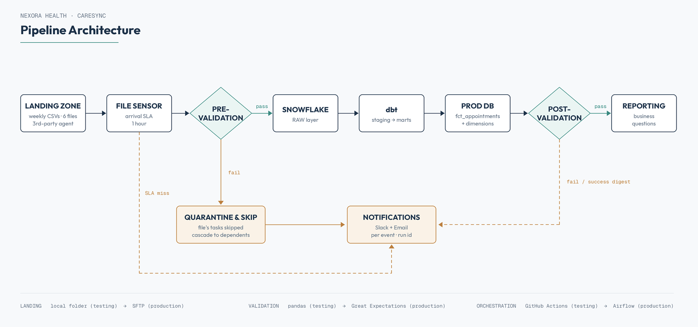

# CareSync Architecture



## Flow

1. **Delivery**: a third-party aggregation agent drops six weekly CSVs into
   a shared Google Drive folder (Phase 1) / SFTP server (Phase 2).
2. **Sensing**: the pipeline polls for each expected file; anything absent
   1 hour past the scheduled delivery time triggers an SLA-miss alert.
3. **Pre-validation gate**: every arrived file is checked (schema,
   mandatory fields, id format, parseability, allowed values, chronology,
   duplicates, row-count sanity) before it may reach Snowflake.
   - Pass: proceeds to load.
   - Fail: quarantined, its load/transform tasks are **skipped** (not
     failed), the skip cascades to foreign-key-dependent datasets, and
     Slack + email fire with the failure detail.
4. **Load**: validated files load into `NEXORA_RAW_WH.RAW` (Snowflake).
5. **Transform**: dbt builds `NEXORA_STAGING_WH.STAGING` (PHI stripped here)
   and `NEXORA_PROD_WH.PROD` (single-fact star schema: `fct_appointments` +
   dimensions + `conditions_detail`, see
   [`docs/entity_relationship.md`](entity_relationship.md) for the
   diagram).
6. **Post-validation gate**: the PROD layer is checked against business
   requirements (no orphan keys, no PHI leakage, row counts in bounds, no
   duplicate natural keys). Pass/fail is notified via Slack + email.
7. **Audit**: every stage writes to `NEXORA_RAW_WH.AUDIT.RUN_AUDIT`,
   traceable by `run_id`.

## Database layout

Three Snowflake databases, one per pipeline layer:

| Database | Purpose |
|---|---|
| `NEXORA_RAW_WH` | Faithful, string-typed copies of validated files. No casting, no cleaning. |
| `NEXORA_STAGING_WH` | Typed and standardized. PHI dropped here. |
| `NEXORA_PROD_WH` | The reporting marts (the star schema). |

Each has one schema of the same name (`RAW`, `STAGING`, `PROD`); the run
audit trail lives in `NEXORA_RAW_WH.AUDIT`. dbt's staging models read across
databases from `NEXORA_RAW_WH` via an explicit `database:` override in
`sources.yml`, and marts materialize into `NEXORA_PROD_WH` via a
`+database:` override in `dbt_project.yml`.

## Dependency map (drives cascade-skip)

```
organizations ─┐
providers ─────┼──► encounters ──► conditions
payers ────────┘
patients ──────────► encounters
```

## Two build stages

| | Phase 1 (testing) | Phase 2 (production) |
|---|---|---|
| Validation | Python + pandas (`validation/pandas/`) | Great Expectations suites (`validation/great_expectations/`) |
| Orchestration | GitHub Actions (`.github/workflows/`) | Airflow (`orchestration/airflow/dags/`) |
| Landing zone | Google Drive | SFTP |
| Business logic | Identical | Identical |
