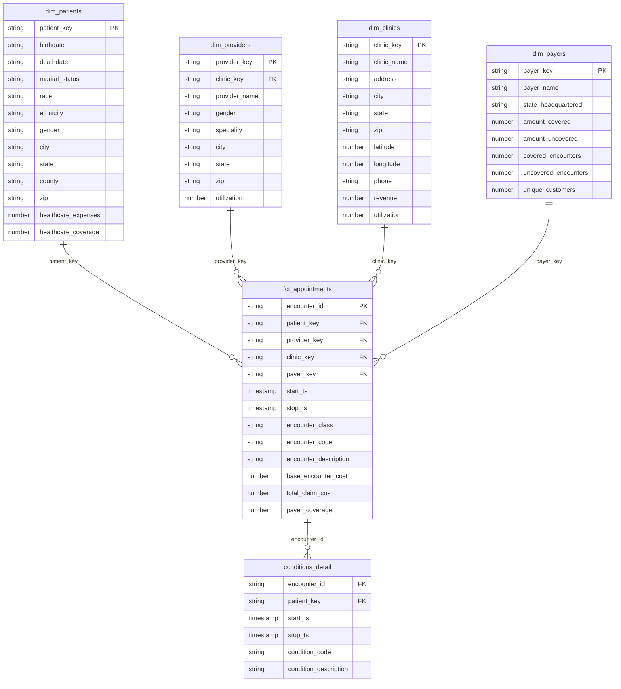

# Entity-Relationship Sketch: NEXORA_PROD_WH Star Schema

Single-fact star schema. `fct_appointments` sits at the center, one row
per encounter (treated as one appointment per the project's framing
note), with four dimensions around it and one detail table hanging off
the fact by `encounter_id`.

## Diagram



## Plain-text version

```
                    dim_patients
                         |
                         | patient_key
                         |
dim_clinics --clinic_key-- fct_appointments --provider_key-- dim_providers
                         |
                         | payer_key
                         |
                    dim_payers


fct_appointments --encounter_id--> conditions_detail
```

## Grain and cardinality

- `fct_appointments`: one row per encounter. Grain is `encounter_id`.
- Each fact row references exactly one `dim_patients`, one
  `dim_providers`, one `dim_clinics`, and one `dim_payers` row (many
  facts to one dimension row, standard star schema fan-out).
- `conditions_detail` is one row per condition; an encounter can have
  zero, one, or many conditions, so this is a one-to-many relationship
  from `fct_appointments`.
- `dim_providers.clinic_key` also links providers to the clinic they
  work at, independent of any specific encounter, this is a dimension
  attribute, not a fact relationship.

## Why single-fact

All five in-scope entities (patients, providers, clinics, payers,
encounters, conditions) roll up into one grain: an appointment. There's
no second, unrelated business process in scope that would need its own
fact table, so one fact table with four surrounding dimensions plus one
detail table is the right shape here, not an over-engineered multi-fact
model.

## PHI minimization boundary

None of the dimension or fact tables above carry the patient's SSN,
first/last name, or any document numbers. Those are dropped at the
staging boundary (`dbt_caresync/models/staging/stg_patients.sql`), before
any mart model is built, so no downstream join or report can
accidentally re-expose them.
