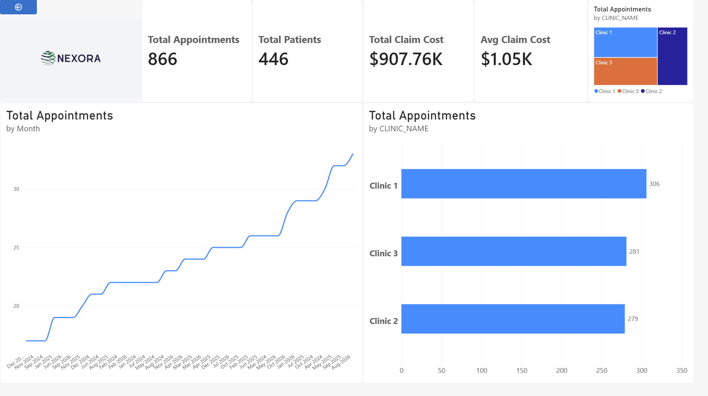
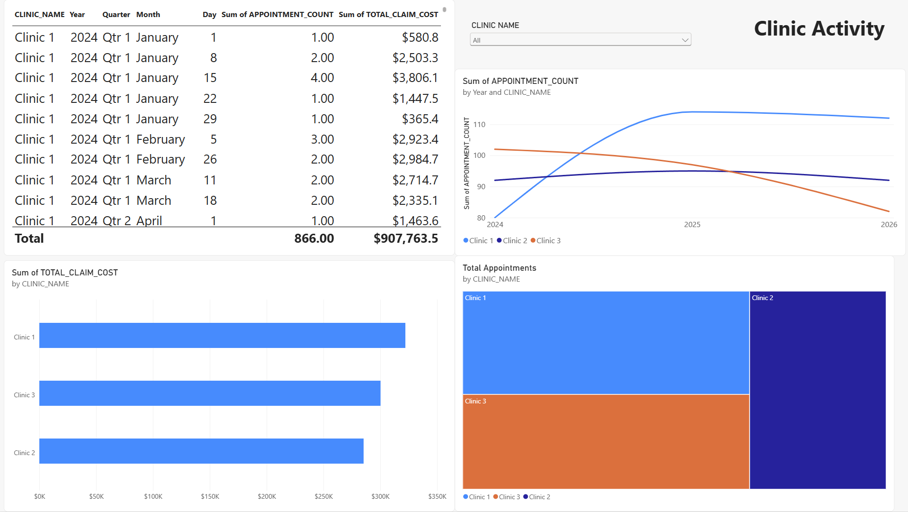
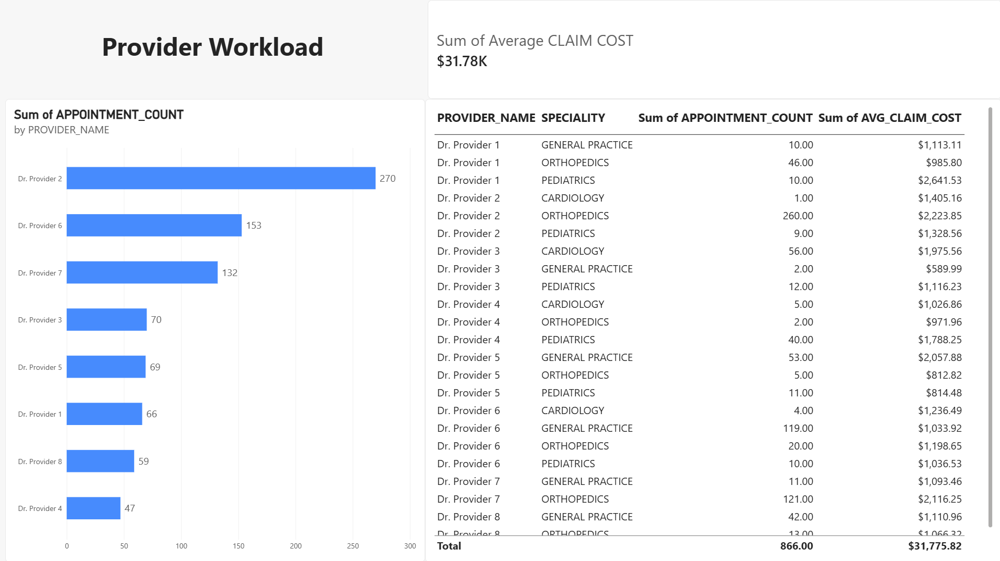
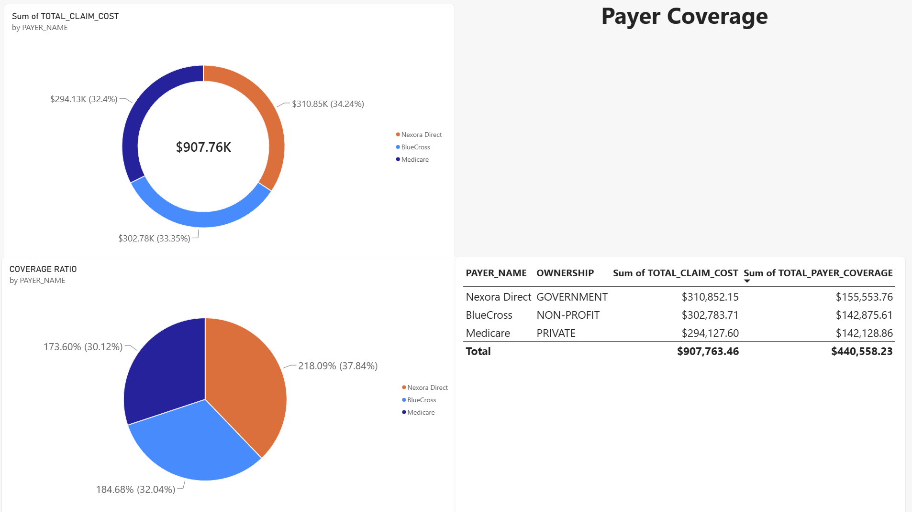
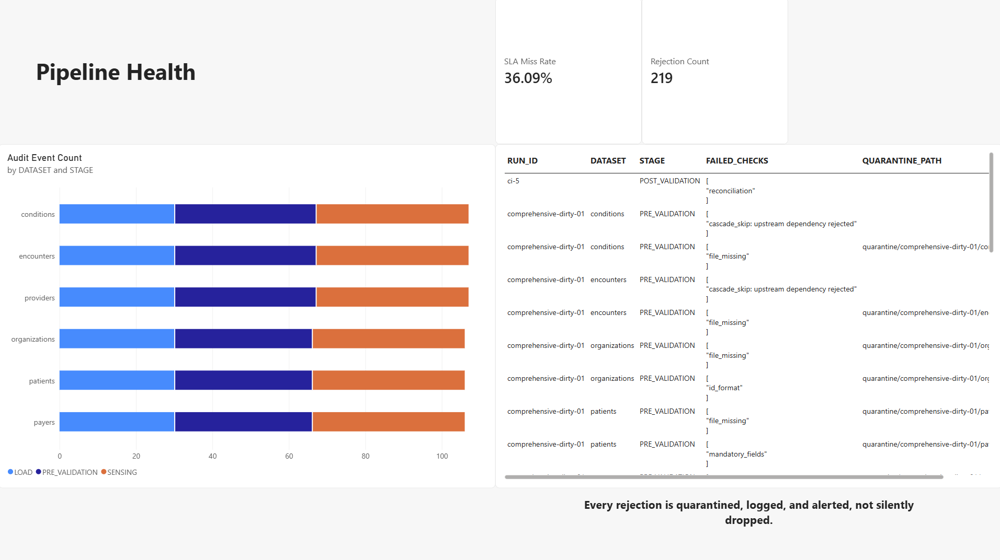

# CareSync Power BI Dashboard

A 5-page executive and operational dashboard built on top of `NEXORA_PROD_WH.PROD`,
the same star schema and reporting views produced by the CareSync pipeline.

## Pages

| Page | Purpose |
|---|---|
| Executive Overview | KPI summary, appointment trend, clinic comparison |
| Clinic Activity | Per-clinic volume and cost trends over time |
| Provider Workload | Ranked provider appointment volume and average cost |
| Payer Coverage | Claim cost share and coverage ratio by payer |
| Pipeline Health | SLA misses, rejection counts, and audit trail from `RUN_AUDIT`, the page that shows this isn't just a BI report on top of clean data, it's built on a pipeline with real data-quality gating |

## Data model

Star schema: `FCT_APPOINTMENTS` (fact) with `DIM_PATIENTS`, `DIM_CLINICS`,
`DIM_PROVIDERS`, `DIM_PAYERS`, `CONDITIONS_DETAIL`, and a generated `DimDate`
calendar table. Five pre-aggregated reporting views
(`RPT_CLINIC_ACTIVITY`, `RPT_PROVIDER_WORKLOAD`, `RPT_PAYER_COVERAGE`,
`RPT_MONTHLY_TRENDS`, `RPT_TOP_DIAGNOSES`) are used directly, standalone,
not joined into the star schema, since they're already grain-correct.

## Connecting

- Snowflake, key-pair authentication (same key used throughout this project,
  `config/snowflake_rsa_key.p8`)
- Import mode (not DirectQuery)

## Screenshots

